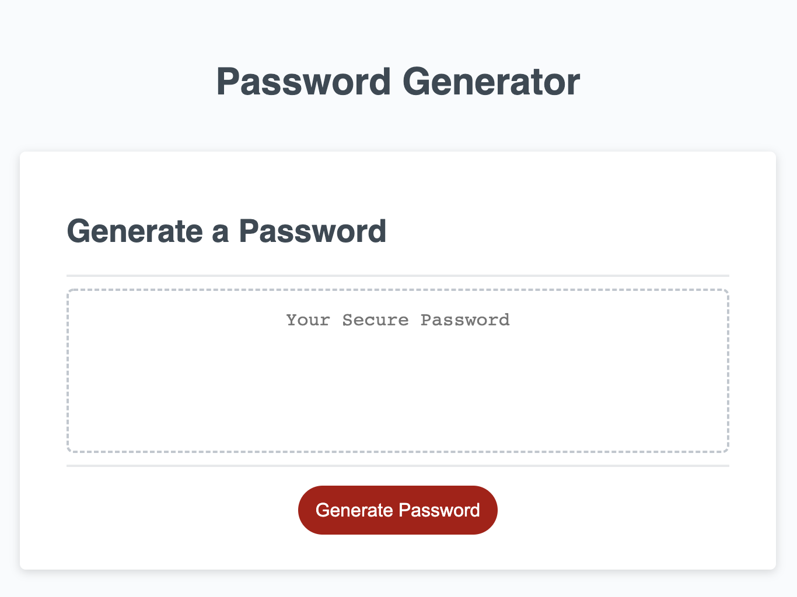

# Password Generator 
This project is viewable at <https://cbarber1984.github.io/password-generator/>

## Purpose of this Project
Create a random password generator that will use user selected criteria to generate a unique and random password.

## What I Learned
- DRY (Don't Repeat Yourself) concepts of writing a function, then calling it rather than writing the same function twice
- Commenting code to make it more readable
- The importance of understanding global vs local scope
- Use of the Fisher Yates algorithm to randomly shuffle an array as opposed to using the sort method
- Use of recursive function calls to force valid user input

